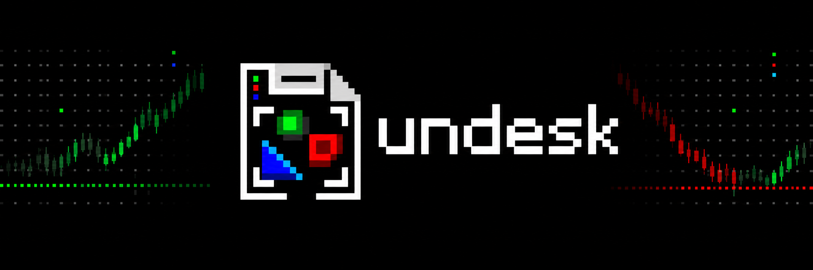

  

# HODI

Hold on, down impossible.

[x.com/0xundesk](https://x.com/0xundesk)

## Live on Hood Chain

    Hodi     0x7539AB9742b853F17cCCF03d4F36f6bb0009e857
    Venue    0x0af2A62deD3634c2AB7A80FeB2b90E31937985d0
    Chain    Hood Chain (id 4663)

First live quote minutes after deploy: ten NVDA shares, floor at spot, thirty
days out, 42 percent vol: 110.53 USDG. That number came out of the chain,
not off a screen.

Crypto's oldest word is HODL, and behind the meme is real advice: what you
should do with something that goes up is nothing. HODI is that word turned
into a machine. Your high becomes your floor, and once it is your floor, it
stays.

A bank sells this as a lookback put with a rolling strike, on a desk full of
people. This is that desk with nobody at it.

Put in stock, and the cash the starting floor costs. From that moment the
vault has one job: at every price the chain publishes, move a little between
stock and cash so that it holds what "the stock, but never below the floor"
pays, and when the stock climbs, drag the floor up behind it and lock it. A
ratchet turns one way. The floor only ever rises.

## The proof

Black and Scholes showed that an option can be built out of stock and cash
alone. The formula is the consequence. HODI builds the option, and adds one
line: whenever the price has climbed enough that a fresh at-the-money put
fits inside the vault with room, the floor is re-struck at the new price and
the guarantee is locked to the new number.

Two numbers say whether the underlying replication works, both from outside
this repository. The textbook value of a standard call is 7.965567455405804.
This engine, in integers only, answers 7.965579. The prints published on
this chain, 992 of them across 74 days, are packed into the test suite.
Twelve month-long windows replay from the tape with a fixed floor. The
manufactured payoff lands within 2.52 percent of what the option owed, the
median across every window, at the thirteen chances a day this chain gives.

## The click on the same tape

Twelve month-long windows again, with clicks turned on and a two percent
minimum bump per click. Each window's floor starts at spot, and every click
demands that a fresh at-the-money put fits inside the vault with a safety
buffer before it fires. The measured result:

    median clicks per 30 days                  1
    median floor rise over the month           7.6%
    median finish above the locked floor       3.9%

Eleven of twelve windows finished comfortably above their locked floor. One
did not, by 10 percent, in the same fast-tape window where the underlying
replication itself missed by that much. The floor is a monotone promise by
construction. Defending it is a physics question, and the physics does not
change: the same 2.52 percent hedge error a fixed floor carries, the moving
floor carries too, plus a tail.

## The desk staffs itself

Every move is a transaction. Anyone may push the button once the position
has drifted past its band, or once a click is waiting. The vault pays the
pusher out of its own cash. The machine hires its own staff, one transaction
at a time.

## What is inside

The EVM has no decimal point, so it has no logarithm, no exponential, no
square root, no bell curve. HODI carries its own, in 1e18 fixed point:
the log by an atanh series, e^x by argument reduction and a Taylor series,
the normal curve by Abramowitz and Stegun, good to seven decimal places.

- `Fixed.sol` and `BS.sol` - the arithmetic and the Black-Scholes core
- `Hodi.sol` - the vault: stock in, floor named, clicks and drifts
  handled by anyone, closed after expiry
- `Venue.sol` - the bridge to the Uniswap V3 style pool where the two legs
  actually trade, with a callback that only pays out while the vault's own
  swap is in flight

The weight the vault targets is always between zero and one, so it never
borrows and never shorts.

## Interface

    quote(shares, floor, expiry, vol)                        -> cost of the initial floor
    open(shares, cash, floor, expiry, vol, band, lift)       -> id
    click(id)                                                -> new floor waiting to lock, or two zeros
    target(id)                                               -> the weight that belongs in stock
    weight(id)                                               -> the weight that is in stock
    value(id)                                                -> what the vault is worth
    rebalance(id)                                            -> anyone, once click or drift has room
    close(id)                                                -> after expiry, everything to the owner

Setting `lift` to the maximum keeps the floor fixed.

## Build and test

    forge test

Every expected value is a closed form, a hand inversion, or the market that
actually happened. Nothing is mocked.

MIT licensed.
